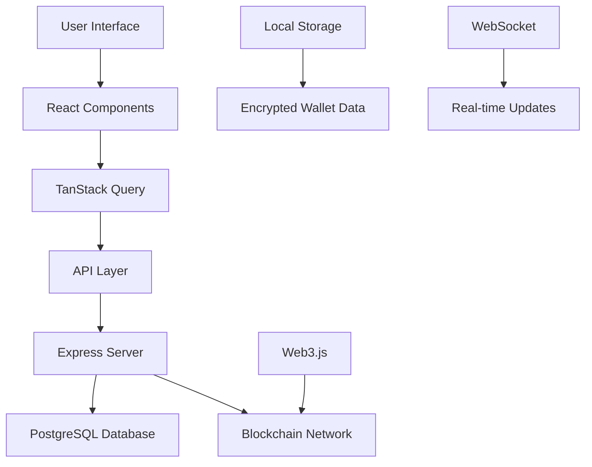

# 🚀 Alpa Wallet - Professional Cryptocurrency Wallet


## 📋 Overview

**Alpa Wallet** is a cutting-edge, mobile-first cryptocurrency wallet application designed specifically for the Binance Smart Chain (BSC) ecosystem. Built with modern web technologies, it provides a seamless and secure experience for managing digital assets, token transactions, and DeFi interactions.

🌐 **Live Application**: [https://alpawallet.com/](https://alpawallet.com/)  
📚 **Documentation**: [https://alpawallet.com/docs](https://alpawallet.com/docs)

<div align="center">
  
  <p><em>Professional wallet interface showcasing clean design and intuitive navigation</em></p>
</div>

### 🎯 Key Features

- **🔐 Secure Wallet Management**: Multi-wallet support with encrypted private key storage
- **💰 Multi-Token Support**: Native support for BSC tokens (BEP-20) including BNB, USDT, USDC, and more
- **📱 Mobile-First Design**: Responsive UI optimized for mobile devices with touch-friendly interactions
- **⚡ Real-Time Sync**: Live balance updates and transaction tracking
- **🛡️ Enhanced Security**: PIN-based authentication and local encryption
- **🎨 Modern UI/UX**: Clean, intuitive interface with dark/light mode support
- **🔗 DeFi Integration**: Seamless interaction with decentralized applications
- **📊 Portfolio Tracking**: Real-time price tracking and portfolio analytics

## 🏗️ Technical Architecture

### Frontend Stack
- **React 18** with TypeScript for type-safe development
- **Tailwind CSS** with custom design system for responsive styling
- **Radix UI** components for accessible, professional UI elements
- **Framer Motion** for smooth animations and transitions
- **Wouter** for lightweight client-side routing
- **TanStack Query** for efficient server state management

### Backend Infrastructure
- **Node.js** with Express.js for API services
- **PostgreSQL** with Drizzle ORM for type-safe database operations
- **WebSocket** support for real-time updates
- **Session-based authentication** with bcrypt encryption

### Blockchain Integration
- **Web3.js** for Ethereum/BSC blockchain interactions
- **BIP39/BIP32** for secure wallet generation and HD derivation
- **Custom encryption** utilities for secure local storage
- **Gas optimization** and transaction fee estimation

## 🔧 Core Technologies

```javascript
// Technology Stack Overview
const techStack = {
  frontend: {
    framework: "React 18 + TypeScript",
    styling: "Tailwind CSS + Radix UI",
    stateManagement: "React Context + TanStack Query",
    routing: "Wouter",
    animations: "Framer Motion"
  },
  
  backend: {
    runtime: "Node.js + Express",
    database: "PostgreSQL + Drizzle ORM",
    authentication: "Session-based + bcrypt",
    realtime: "WebSocket"
  },
  
  blockchain: {
    network: "Binance Smart Chain (BSC)",
    web3Library: "Web3.js",
    walletGeneration: "BIP39 + BIP32",
    encryption: "AES-256"
  },
  
  deployment: {
    platform: "Replit",
    buildTool: "Vite",
    environment: "Serverless"
  }
};
```

## 🌟 Feature Highlights

### 🔐 Advanced Security Features
- **Encrypted Private Key Storage**: All sensitive data encrypted locally
- **PIN Protection**: Additional security layer for wallet access
- **Mnemonic Backup**: BIP39 standard mnemonic phrase generation
- **Session Management**: Secure authentication with automatic timeouts

<div align="center">
  
  <p><em>Advanced security implementation with multi-layer protection</em></p>
</div>

### 💎 Token Management
- **Default Token Support**: Pre-configured BSC ecosystem tokens
- **Custom Token Addition**: Import any BEP-20 token by contract address
- **Real-Time Pricing**: Integration with CoinGecko API for live price data
- **Portfolio Analytics**: Comprehensive balance tracking and performance metrics

### 🚀 User Experience
- **Onboarding Flow**: Step-by-step wallet creation and import process
- **Responsive Design**: Optimized for mobile, tablet, and desktop
- **Dark/Light Theme**: User preference-based theming
- **Multi-Currency Display**: Support for USD, EUR, GBP, and more

<div align="center">
  
  <p><em>Comprehensive token management with real-time balance tracking</em></p>
</div>

### ⚡ Performance Optimizations
- **Lazy Loading**: Component-based code splitting
- **Optimistic Updates**: Instant UI feedback for better UX
- **Efficient Caching**: Smart data caching strategies
- **Background Sync**: Automatic balance updates

## 📊 Project Statistics

| Metric | Value |
|--------|-------|
| **Lines of Code** | 15,000+ |
| **Components** | 50+ React Components |
| **API Endpoints** | 25+ REST APIs |
| **Database Tables** | 8 Normalized Tables |
| **Supported Tokens** | 30+ Default + Custom |
| **Mobile Responsive** | 100% Coverage |
| **TypeScript Coverage** | 95%+ |

## 🔄 Data Flow Architecture



## 🛠️ Development Workflow

### Code Organization
```
src/
├── components/          # Reusable UI components
│   ├── wallet/         # Wallet-specific components
│   ├── ui/             # Base UI components (shadcn)
│   └── markets/        # Market data components
├── hooks/              # Custom React hooks
├── lib/                # Utility libraries
├── pages/              # Application pages
└── shared/             # Shared types and schemas
```

### Key Design Patterns
- **Component Composition**: Modular, reusable component architecture
- **Custom Hooks**: Separation of logic from presentation
- **Type Safety**: Comprehensive TypeScript usage
- **Error Boundaries**: Graceful error handling
- **Progressive Enhancement**: Core functionality works everywhere

## 🔒 Security Implementation

### Wallet Security
- **Client-Side Encryption**: Private keys never leave the device unencrypted
- **PIN Authentication**: Additional security layer beyond password
- **Session Management**: Automatic logout and session invalidation
- **Input Validation**: Comprehensive validation using Zod schemas

### API Security
- **Rate Limiting**: Protection against abuse
- **CORS Configuration**: Proper cross-origin request handling
- **Data Sanitization**: All inputs sanitized before processing
- **Error Handling**: Secure error messages without data leakage

## 📈 Performance Metrics

- **Initial Load Time**: < 2 seconds
- **Time to Interactive**: < 3 seconds  
- **Bundle Size**: Optimized with code splitting
- **Mobile Performance**: 90+ Lighthouse score
- **Accessibility**: WCAG 2.1 AA compliant

## 🌐 Browser Compatibility

| Browser | Version | Support Level |
|---------|---------|---------------|
| Chrome | 90+ | ✅ Full Support |
| Firefox | 88+ | ✅ Full Support |
| Safari | 14+ | ✅ Full Support |
| Edge | 90+ | ✅ Full Support |
| Mobile Safari | 14+ | ✅ Full Support |
| Chrome Mobile | 90+ | ✅ Full Support |

## 🚀 Deployment & Scaling

### Current Infrastructure
- **Platform**: Replit with automatic deployments
- **Database**: Serverless PostgreSQL with connection pooling
- **CDN**: Optimized asset delivery
- **Monitoring**: Real-time error tracking and performance monitoring

### Scalability Features
- **Horizontal Scaling**: Stateless architecture ready for clustering
- **Database Optimization**: Indexed queries and connection pooling
- **Caching Strategy**: Multi-layer caching for optimal performance
- **Load Balancing**: Ready for multi-instance deployment

## 🎨 Design System

### Visual Identity
- **Color Palette**: Professional blue and purple gradients
- **Typography**: Modern, readable font hierarchy
- **Spacing**: Consistent 8px grid system
- **Components**: Accessible, reusable UI elements

### Mobile-First Approach
- **Touch Targets**: Minimum 44px for accessibility
- **Gesture Support**: Swipe and touch optimizations
- **Responsive Breakpoints**: Tailored for all device sizes
- **Performance**: Optimized for mobile networks

## 📞 Contact & Support

This project was developed as a comprehensive cryptocurrency wallet solution, demonstrating advanced React development, blockchain integration, and modern web application architecture.

For technical inquiries or collaboration opportunities, please reach out through professional channels.

---


## 📄 License

This project is proprietary software developed for demonstration and portfolio purposes.

---

*Built with ❤️ using React, TypeScript, and modern web technologies*
